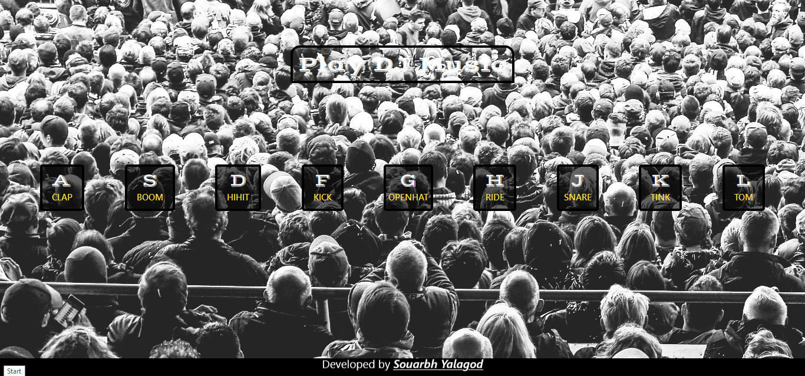

# Drup Kit Java script challange

## Table of contents

- [Overview](#overview)
  - [The challenge](#the-challenge)
  - [Screenshot](#screenshot)
  - [Built with](#built-with)
  - [Links](#links)

## Overview

### The challenge

Users should be able to:

- checking the key press envents are smoothily working or nor by activating the assigned trassform properties``
- usage of java script and time interval propetries

### Screenshot

### Built with

- Semantic HTML5 markup
- CSS custom properties
- Flexbox
- tailwindcss
- pseudo effet

### Links

- Live Site URL: [Solution Github](https://github.com/sourabh-yalagod/Drum-kit-javaScript-page)
- Live Site URL: [Live Site](https://sourabh-yalagod.github.io/Drum-kit-javaScript-page/)

